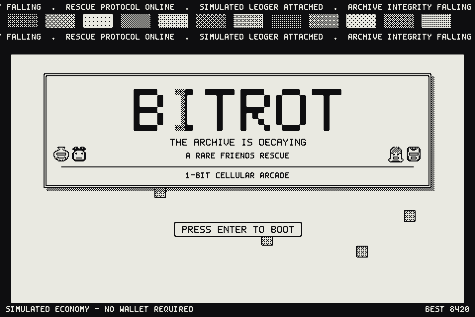
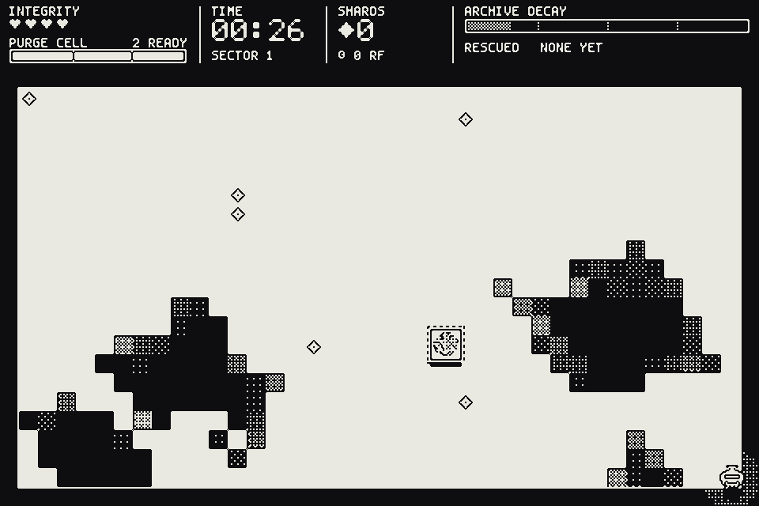
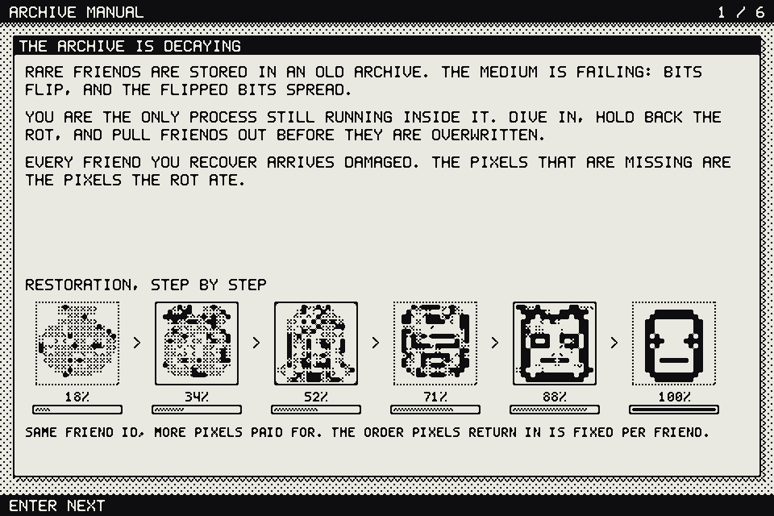
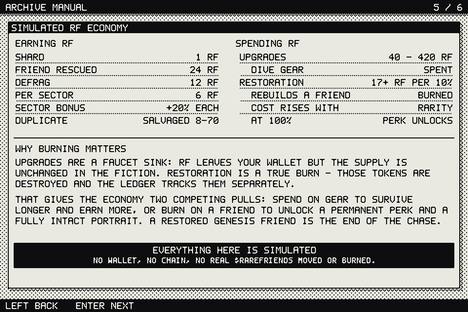
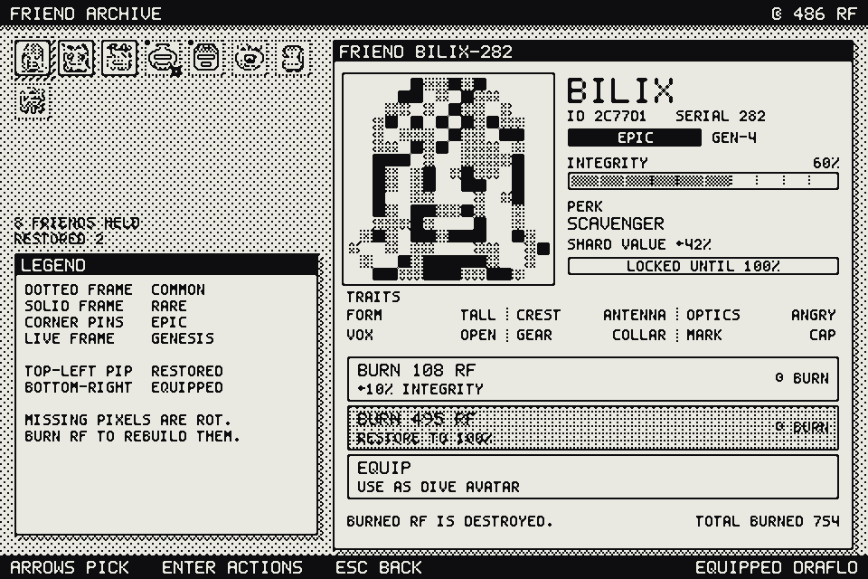

# BITROT

**A 1-bit cellular-automaton arcade game about rescuing Rare Friends from a decaying archive.**

Built for the [Rare Friends Vibeathon](https://github.com/spokesz/rarefriends-vibeathon) (20–30 September 2026).
No FriendSDK and no wallet. Plain ES modules, a 1-bit software renderer, a Node server that replays
every dive to verify it — and **zero dependencies** on either side.



> **Everything about the economy in this build is simulated.** No wallet is connected, no chain is
> touched, no real $RAREFRIENDS is minted, spent or burned. The balances are real records in the
> game's own database — they are simply not tokens.

---

## The idea

Rare Friends are stored on failing media. Bits flip, and flipped bits spread. You are the last
process still running inside the archive: dive in, hold back the rot, and pull Friends out before
they are overwritten.

Two things make this more than a score chase:

**1. The arena is a cellular automaton, not a level.**
Every generation, a clean cell may turn rotten, and the chance climbs steeply with how many rotten
neighbours it has. Rot never dies on its own — the only thing that removes it is you. So concave
pockets seal themselves in seconds, open ground is threatened slowly, and the whole board is a thing
you *garden* rather than a thing you dodge. Your purge does not just clear a disc, it **scars** the
ground so it cannot rot again for a while. Skilled play is shaping the arena, not panic-clearing it.

**2. Burning $RAREFRIENDS literally rebuilds a Friend's pixels.**
Every Friend you rescue arrives corrupted — the pixels that are missing from the portrait are the
pixels the rot ate. Burning RF restores them, in a fixed order, ten percent at a time, and the
tokens are destroyed. At 100% the Friend is whole and its perk unlocks. The sink is not an abstract
counter: you can see exactly what your burn bought.



---

## Play it

**Live preview:** https://kamideathless.github.io/bitrot/

The landing page is at `/`, the game itself at `/play.html`. No wallet, no sign-in, no install.

> A static host can only serve the **local sandbox**: the game is fully playable, but nothing is
> verified and nothing reaches a leaderboard. For verified play you need the server below — it is
> one `npm start` away and has no dependencies either.

### Run it

Requires **Node.js 22.5+** (for the built-in `node:sqlite`). There is no build step and no
`node_modules` — not one dependency, server included.

```bash
git clone https://github.com/kamideathless/bitrot.git
cd bitrot
npm start
```

Then open `http://127.0.0.1:4173/`.

For anything public, set a signing key and turn on secure cookies:

```bash
BITROT_SECRET="$(openssl rand -base64 32)" BITROT_SECURE_COOKIES=1 NODE_ENV=production npm start
```

The server refuses to start in production without `BITROT_SECRET`, and there is no default value
anywhere in the repository.

| Variable | Default | What it does |
|---|---|---|
| `PORT` / `HOST` | `4173` / `127.0.0.1` | where to listen |
| `BITROT_SECRET` | *required in production* | signing key; without it, sessions do not survive a restart |
| `BITROT_DATA` | `./data` | SQLite location (never served over HTTP) |
| `BITROT_SECURE_COOKIES` | `0` | set to `1` behind TLS |
| `BITROT_TRUST_PROXY` | `0` | honour `x-forwarded-for` (only behind a proxy you control) |
| `BITROT_ORIGINS` | *same-origin only* | extra origins allowed to make writes |

## Controls

| Action | Keyboard | Touch |
|---|---|---|
| Move | `W A S D` / arrow keys | drag anywhere on the left half — the stick appears under your finger |
| Purge | `Space` / `J` — one press per purge | `PRG` button |
| Dash | `Shift` / `K` | `DSH` button |
| Select | `Enter` | tap |
| Back / pause | `Esc` | ▮▮ button, top right |
| Mute | `M` | Settings |

Every screen is fully keyboard navigable. Reduced motion (no shake, flash, particles or dither
animation), mute, a CRT overlay toggle and a true inverted palette all live in **Settings**; the
game also honours your system `prefers-reduced-motion` setting on its own.

---

## Rules

### The dive

You start in a cleared pocket in the middle of a 40×23 arena with **3 integrity** and a full
**purge cell**.

| Thing | What it does |
|---|---|
| **Shard** | +1 RF, +9 energy. If the rot reaches a shard first, it is gone. They never spawn within 5 cells of you, so you cannot farm them in a corner. |
| **Capsule** | A trapped Friend. First at 14s, then every 19s. It survives 6s buried under rot — purge it free. Rescuing also restores 1 integrity. |
| **Defrag canister** | Wipes *every* rotten cell on the board and refills your cell. First at 42s, then every 40s. It always spawns in the most dangerous place on the map. |
| **Sector** | Every 45s. Decay accelerates, the payout multiplier rises, and every purge costs ~11% more energy. |
| **Hunt** | From 18s the rot starts seeding itself 4–8 cells from you on a timer that tightens with the sector. Camping one cleared corner is not a strategy. |

Touching rot costs 1 integrity, grants 1.35s of invulnerability and carves a small pocket — a
smaller one than a real purge, deliberately, so taking a hit is never the cheap way to clear ground.
**Integrity only comes back by rescuing a Friend.** That is the point: the thing that keeps you
alive is the thing the game is about.

Dash is invulnerable for its whole 0.16s, so you can cut straight through a thin wall of rot.

### The automaton

A clean cell with `n` rotten neighbours becomes rotten with probability `birth[n] × pressure`:

| rotten neighbours | 1 | 2 | 3 | 4 | 5 | 6 | 7 | 8 |
|---|---|---|---|---|---|---|---|---|
| base chance / generation | 0.5% | 0.9% | 1.7% | 3.4% | 7.8% | 17.5% | 38% | 78% |

`pressure` runs from 0.5× at the start to 2.6× at full depth, and the generation interval tightens
from 220ms to 120ms. Purged cells are **scarred** for 14 generations (30 fully upgraded) and cannot
be reborn until the scar expires. Spontaneous bit flips seed new rot anywhere in open ground.

Left completely alone, the arena is 86% rotten in about **60 seconds**. Someone purging well holds
that off to ~93s at base gear and ~150s fully upgraded.



---

## The simulated economy



### Earning RF

| Source | RF |
|---|---:|
| Shard collected | 1 |
| Friend rescued | 24 |
| Defrag triggered | 12 |
| Per sector reached | 6 |
| Sector multiplier | ×(1 + 0.09 per sector past the first) |
| Duplicate Friend (salvaged) | 10 / 20 / 40 / 85 by rarity |

A scripted reference pilot earns ~65 RF per run with no upgrades, ~145 at mid gear and ~475 fully
geared; a human chasing capsules earns more.

### Spending RF — two competing sinks

**Upgrades are spent.** Permanent dive gear. RF leaves your balance, but in the fiction the supply
is unchanged.

| Upgrade | Levels | Cost | Effect per level |
|---|---|---|---|
| Purge Coil | 4 | 45 / 110 / 230 / 420 | purge radius +6px |
| Cell Bank | 4 | 40 / 95 / 200 / 380 | +15 max energy |
| Scar Etch | 3 | 55 / 130 / 260 | +5–6 generations of scar |
| Core Plate | 2 | 150 / 420 | +1 max integrity |
| Drift Boots | 3 | 60 / 145 / 300 | +7 px/s move speed |
| Lode Coil | 3 | 50 / 120 / 250 | +7–9px pickup range |

**Restoration is burned.** RF spent rebuilding a Friend is destroyed and tracked separately on the
ledger. Cost is `17 RF × rarity multiplier × (1 + 2.4 × progress)` per 10% of integrity, so the last
pixels are the dearest, and a GENESIS Friend costs 4.5× what a COMMON one does.

A Friend arrives at 22–48% integrity. What that works out to, measured against the reference pilot:

| Rarity | Odds | Restore multiplier | RF to whole | Early runs | Geared runs |
|---|---:|---:|---:|---:|---:|
| COMMON | 62% | 1.0× | ~240 | 3.7 | 0.5 |
| RARE | 26% | 1.7× | ~430 | 6.6 | 0.9 |
| EPIC | 9.5% | 2.6× | ~705 | 10.8 | 1.5 |
| GENESIS | 2.5% | 4.5× | ~1220 | 18.7 | 2.6 |

Every upgrade level in the game together costs 3 460 RF — about seven fully-geared dives. So gear and
restoration are genuinely competing for the same wallet rather than one being obviously correct.

At 100% a Friend's perk activates while equipped:

| Perk | Effect (scales with rarity) |
|---|---|
| Scrubber | purge radius +10…26% |
| Flywheel | energy regen +17…45% |
| Lightfoot | move speed +6…16% |
| Scavenger | shard value +21…56% |
| Afterimage | dash cooldown −16…−42% |
| Plating | +1 max integrity (+2 at EPIC and above) |
| Lodestone | pickup range +54…144% |
| Echo | scar duration +30…80% |

So every run poses the same question: **spend on gear to survive longer and earn more, or burn on a
Friend for a permanent perk and an intact portrait?** A fully restored GENESIS Friend is the end of
the chase.



---

## How this connects to Rare Friends

Every Friend in BITROT is derived from a **6-hex-digit id**. Form, crest, optics, vox, gear,
marking, rarity, generation, name, perk and the exact order in which its pixels come back are all
pure functions of that one number — the same relationship a tokenId has to a Generations NFT.

```js
friendTraits('7A31C4')
// → { head:'gem', ears:'cat', eyes:'star', mouth:'fang', accessory:'crown',
//     pattern:'rim', rarity:'EPIC', generation:4, name:'QUEDAR', perk: … }
```

In a production build that id **is** the tokenId and the portrait is the canonical Rare Friends
artwork served through FriendSDK — `friendSprite(id, integrity)` is the single seam where that swap
happens, and the corruption mask applies to any 16×16 source equally well. Here it is drawn
procedurally so that the game runs for anyone, with no wallet and no ownership gate, which is what
the Vibeathon's independent-stack path asks for.

Rarity distribution over 20 000 rolls: COMMON 62%, RARE 26%, EPIC 9.5%, GENESIS 2.5%.

### What a production build would need

- FriendSDK's wallet + Friend selection in place of the local id roll, with the ownership gate intact.
- Canonical artwork instead of the procedural portraits (swap `friendSprite`).
- An on-chain burn for restoration, and an authority for the RF faucet — the numbers here are
  balanced as a closed loop and would need a real sink/source review before touching live tokens.
- Server-side score validation. Right now the save is local and trivially editable, which is fine
  for an MVP and not fine for a leaderboard.

---

## The server

The game is not a page that keeps its own score. Every dive that counts is issued, replayed and
scored by the server; the browser is a controller and a screen.

This is possible because `Run` is **deterministic**: the same seed, the same stat block and the same
sequence of inputs always produce the same dive, on any machine. So the client never reports an
outcome — it reports what buttons were pressed.

```
browser                                   server
   │  POST /api/run/start                   │
   │ ─────────────────────────────────────► │  picks the seed, freezes the stat block
   │ ◄───────────────────────────────────── │  one-shot ticket + seed + stats
   │                                        │
   │  plays; records one 2-byte code per    │
   │  tick, run-length encoded (~7 KB for   │
   │  a 60-second dive)                     │
   │                                        │
   │  POST /api/run/submit {ticket, trace}  │
   │ ─────────────────────────────────────► │  replays the dive with its own seed and stats,
   │                                        │  computes the score, the RF and the rescued
   │                                        │  Friend ids itself, applies them in one
   │ ◄───────────────────────────────────── │  transaction, returns the new save
```

A 60-second dive verifies in about **40 ms**. The client's claimed numbers are not read at all —
you can put any `score` you like in the request body and the server will ignore it, which is one of
the tests.

### What that buys

* **Scores cannot be invented.** To fake a score you would have to produce an input trace that
  genuinely achieves it under a seed you did not choose — which is just playing the game.
* **Currency cannot be conjured.** Upgrades and restoration burns are applied to the stored save
  inside a transaction, priced by the server.
* **Runs cannot be replayed for profit.** A ticket is single-use, account-bound and expiring, and it
  is claimed *before* the replay so two concurrent submissions cannot both land.
* **Gear cannot be back-dated.** The stat block is frozen into the ticket when the dive is issued.

### Online, or a sandbox — never a merge

When the server is reachable, its save is the only save and the browser copy is a cache of it. When
it is not, the game runs as a clearly-labelled **local sandbox** whose progress is never submitted.
There is deliberately no merge between the two: reconciling two divergent economies is exactly how
duplication bugs get born, and the honest answer is to not have two.

### Accounts

No passwords and no email. An account is a random id plus a one-time recovery key, hashed with
scrypt, shown once so you can play on a second device. Nothing personal is stored, so there is
nothing personal to leak.

### Security posture

| Concern | How it is handled |
|---|---|
| Score / currency forgery | server-side replay; client outcomes never read |
| SQL injection | `node:sqlite` prepared statements only; no SQL is ever built from a string |
| XSS | strict CSP (`script-src 'self'`, no inline styles or scripts); names sanitised on write; the game draws text into a canvas, not the DOM |
| CSRF | `SameSite=Strict` cookie **and** a required per-session header token **and** an origin check |
| Session theft | `HttpOnly`, `Secure` behind TLS, tokens stored only as SHA-256 hashes, rotated on restore |
| Brute force | scrypt on recovery keys, constant-time compare, equal work for a missing account |
| Path traversal | normalise, then verify the resolved path is inside the root; `data/`, `server/` and dotfiles are never served |
| Request floods | fixed-window limits per IP and per account, with a bounded key map so the limiter cannot itself be the DoS |
| Replay CPU exhaustion | hard tick ceiling, byte ceiling, and a wall-clock budget on every replay |
| Information leaks | unexpected errors log server-side and return a bare 500; internal ids never appear in the leaderboard |

### API

| Endpoint | Purpose |
|---|---|
| `GET /api/me` | who am I, and my authoritative save |
| `POST /api/auth/register` | create an anonymous account (returns the recovery key once) |
| `POST /api/auth/restore` | sign in on another device |
| `POST /api/auth/logout` | drop the session |
| `POST /api/run/start` | issue a seed + one-shot ticket |
| `POST /api/run/submit` | submit an input trace; get the verified result |
| `POST /api/economy/upgrade` | buy an upgrade |
| `POST /api/economy/restore` | burn RF to rebuild a Friend |
| `POST /api/economy/equip` | equip a Friend you own |
| `GET /api/leaderboard` | top verified runs |

## Under the hood

Everything renders into a **single `Uint8Array` of 0s and 1s at 480×320**, which is then blitted to
the canvas with integer scaling. Keeping the renderer strictly 1-bit is what makes the game look
like a real pixel display rather than a canvas with a pixel font on it:

- shading exists only as ordered (Bayer) dithering, so rot density reads as age;
- effects like the purge shockwave are literally XOR inversions of the framebuffer;
- the picture is presented through **Scale2x/EPX**, which rounds off single-pixel corners and
  diagonals on the way to the screen: still pixel art, just a finer grain than a 5×7 glyph blown
  up three times. It is a toggle in Settings for anyone who prefers hard edges;
- both fonts (5×7 and a 4×6 micro) are hand-drawn bitmaps in `src/core/font.js`, so there is no
  webfont to load and no antialiasing to fight;
- the whole palette is two colours, which makes the inverted "dark mode" exact rather than themed.

The logical screen is 480×320 and scales to **960×640** at ×2 — deliberately the same viewport
FriendSDK reference games use, so this would drop into the SDK container unchanged.

```
index.html    landing page          play.html   the game
landing.css   styles.css

src/
  core/    gfx.js (1-bit framebuffer)  font.js (bitmap fonts)  input.js  audio.js  rng.js  store.js
  game/    automaton.js (the rot)  run.js (a dive)  economy.js (RF)  friends.js  trace.js (input codec)
  net/     client.js (API)  economy.js (online/offline facade)
  ui/      widgets.js  field.js
  scenes/  title  hub  play  results  upgrades  collection  help  settings
  landing/ landing.js (the page draws itself with the game's engine)

server/
  main.mjs   routes + boot      http.mjs  headers, limits, static, rate limiting
  api.mjs    endpoint handlers  auth.mjs  accounts, sessions, CSRF
  db.mjs     node:sqlite        replay.mjs  server-side re-simulation
  config.mjs environment

tests/     164 node:test cases
tools/     tune.mjs (balance)  shots.mjs (headless screenshots)  portraits.mjs  check.mjs  headless.mjs
```

All audio is generated live by a small square-wave synth (`src/core/audio.js`) — no audio files.

---

## Checks

```bash
npm run check   # import every module, then the full test suite
npm test        # 164 tests
npm run tune    # balance harness: arena fill rates + scripted full runs
npm run shots   # regenerate docs/*.png headlessly
```

**Status: 164/164 passing.** No mocks anywhere — the server tests drive the real HTTP server on an
ephemeral port against an in-memory database.

| Area | What is asserted |
|---|---|
| `automaton` | walls are never eaten, rot never shrinks, scars block rebirth and then expire, defrag wipes, purge respects the wall ring, birth table is monotonic |
| `economy` | upgrade costs rise, purchases are immutable and refuse when broke, restore cost rises with progress and rarity, `burnRestore` destroys exactly what it spends, payouts never go negative |
| `friends` | traits are pure in the id, every trait names art that exists, restoration only ever *adds* pixels and in a stable order, rarity distribution is in band |
| `run` | the player cannot leave the arena, idling is fatal, purging and upgrades measurably buy time, shards cannot be farmed in a corner, same seed replays identically |
| `trace` | every intent round-trips through the wire format bit-exactly, hostile traces throw rather than parse, the recorder respects its ceiling, **a recorded dive replays to an identical result** |
| `server` | tickets are single-use and account-bound, a claimed score is ignored, a trace against a foreign seed cannot buy a score, garbage and over-long traces are refused before simulation, CSRF and origin checks hold, sessions cannot be forged, traversal cannot escape the root, the database is unreachable over HTTP, rate limits fire |
| `online-play` | the play scene really does request a ticket, record, submit and adopt the server's save; the report does not double-credit a verified run; the offline sandbox never submits; an unreachable server degrades instead of breaking |
| `store` | hostile/corrupt saves are clamped rather than trusted, a throwing `localStorage` is survivable |
| `render` | drawing never writes outside the buffer, clipping holds, dither is monotonic, every glyph is well-formed |
| `scenes` | every screen renders headlessly — fresh save, full save, reduced motion, touch mode |
| `strings` | every string the UI draws is covered by both bitmap fonts (no silent `?` glyphs) |
| `layout` | a probe records every string and panel the UI draws, then asserts nothing collides, nothing leaves the screen and nothing spills out of its frame — on an empty save, a full one, and one with absurd six-figure balances |

Measured: a 60-second dive produces a ~7 KB trace and verifies server-side in **~40 ms**; the game
holds 12.1 ms average frame time (worst 13.1 ms) during a dive.

### Known issues and limits

- **The landing page needs JavaScript** — it renders its headings and its live demos with the game's
  own engine. There is a plain fallback with a link to the game.
- **Offline progress is a sandbox and is discarded** the next time the server is reachable. That is
  the deliberate alternative to merging two divergent economies; it is signposted in the HUD, on the
  report screen and in the terminal footer.
- **The recovery key is the only way back into an account.** Lose it and the account is gone —
  there is no email to reset against, which is the point, but it is a real limitation.
- **No moderation tooling.** Display names are character-restricted and length-capped, but there is
  no report/ban workflow beyond a `banned` column.
- **Rate limits are per-process and in memory.** Fine for one instance; a multi-instance deployment
  would need them moved to shared storage.
- **Replay cost is bounded but not queued.** A burst of submissions is limited per account and per
  IP, but there is no global work queue in front of the replayer.
- The arena is a fixed 40×23 with no camera or scrolling world.
- Audio starts only after the first keypress or tap (browser autoplay policy).
- Touch controls were tested in Chromium device emulation and on a touchscreen laptop, not across a
  range of real phones.
- The difficulty ramp tops out around 370s, so a perfect fully-geared player can hold on past that.
- Friend portraits are procedural placeholders, not Rare Friends artwork.

### Not claimed

This has not had a third-party security review, and it has never run under real load. The threat
model it is built against is *a player trying to cheat the economy and the leaderboard*, plus the
usual web hygiene — not a targeted attacker with resources.

## Credits

Everything in this repository — code, the two bitmap fonts, the procedural Friend art, the chip
synth — was made for this Vibeathon. No third-party assets, no runtime dependencies.

MIT licensed. See [LICENSE](LICENSE).
